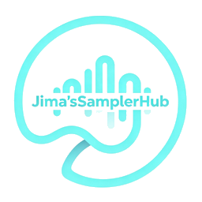
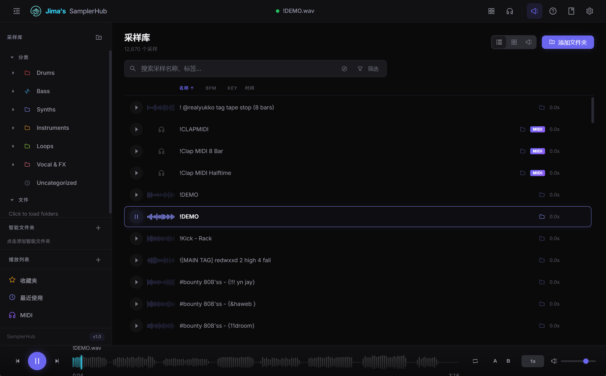
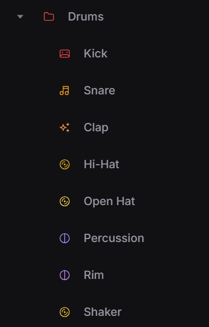
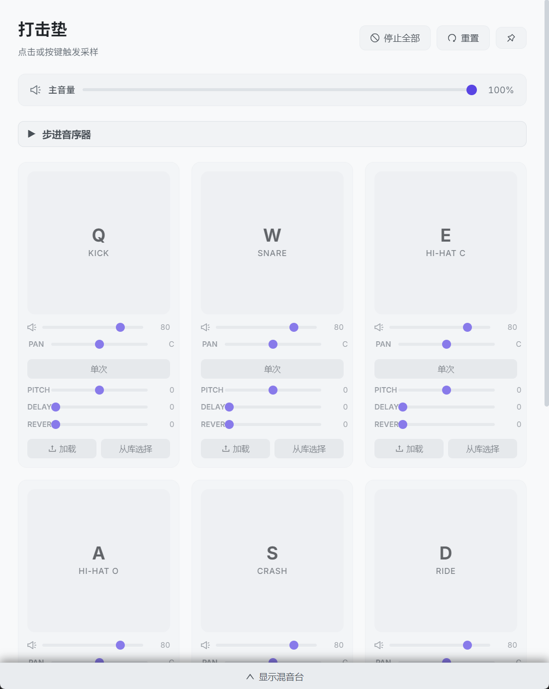
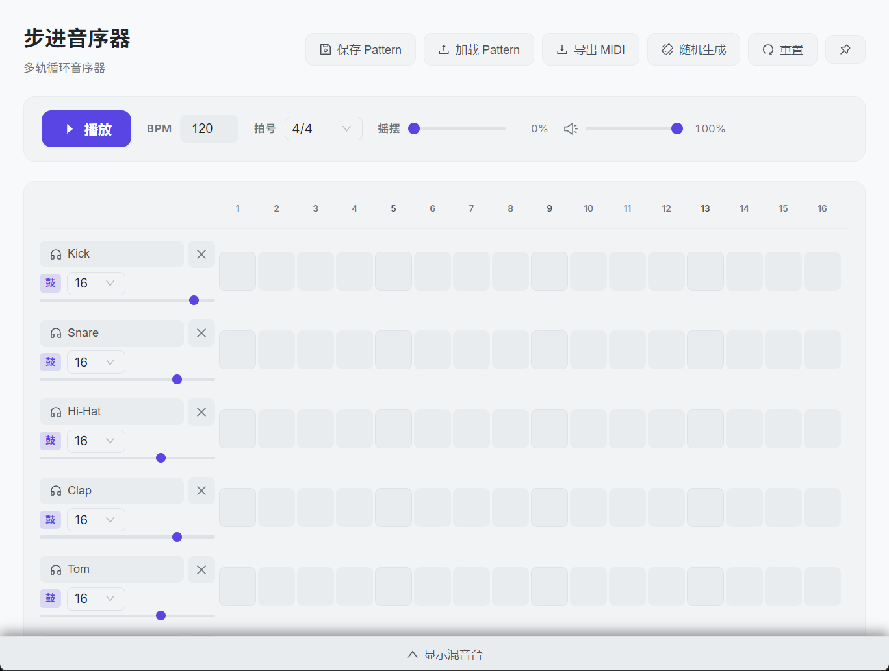

<div align="center">



# Jima's SamplerHub

**AI-powered sample management workstation for music producers**

[](LICENSE)
[](https://electronjs.org)
[](https://react.dev)
[](https://typescriptlang.org)
[](https://tailwindcss.com)

[English](#english) · [中文](#中文)

</div>

---

<a id="english"></a>
## English

### What is SamplerHub?

SamplerHub is an intelligent sample management tool designed for music producers. It bridges the gap between scattered sample libraries and creative workflow, offering AI-powered organization, instant preview, and seamless DAW integration.

### Features

**Smart Sample Management**
- Auto-scan & index local sample libraries (WAV, MP3, FLAC, MIDI, and more)
- AI classification into 40+ categories (Drums, Bass, Synths, FX, etc.)
- Real-time folder monitoring with automatic sync
- Duplicate detection via audio fingerprinting
- Smart tagging + favorites / recently played

**Audio Analysis**
- BPM detection with beat-grid visualization
- Musical key identification
- CLAP semantic embeddings for AI similarity search
- Waveform visualization with real-time playback progress

**Creative Tools**
- 16-pad drum machine with velocity-sensitive triggering
- Step sequencer for pattern-based composition
- Piano roll for melodic programming
- Mixer with per-channel controls

**Online Resources**
- Integrated free sample libraries: Freesound, Pixabay, SND.dev, Lotsofsounds
- One-click download to local library
- Preview before download with built-in audio player

### DAW Integration

Drag samples directly from SamplerHub into any DAW:

- **Drag & Drop**: Drag any sample from the library view directly onto your DAW's timeline or sampler
- **Multi-select**: Select multiple samples (Ctrl+Click or Shift+Click) and drag them all at once
- **Context Menu**: Right-click a sample and choose "Drag to DAW"
- **Batch Export**: Use the toolbar button to drag all selected samples to your DAW
- **Compatible with**: Reaper, Ableton Live, FL Studio, Logic Pro, Studio One, Cubase, and any DAW that accepts file drops
- **Format Preserved**: Original audio format is maintained during drag — no re-encoding

**Multi-language Support**
11 languages: English, Chinese, Japanese, Korean, German, French, Spanish, Italian, Portuguese, Russian, Uyghur

### Screenshots

<div align="center">

| Main Library | Category Tree |
|:---:|:---:|
|  |  |

| Drum Pad | Step Sequencer |
|:---:|:---:|
|  |  |

</div>

### System Requirements

| Platform | Version | Architecture |
|----------|---------|-------------|
| Windows | 10 / 11 | x64 |
| macOS | 12+ | Intel / Apple Silicon |

- **RAM**: 4GB minimum, 8GB recommended
- **Storage**: 500MB for app, additional space for sample libraries

### Installation

**Download Pre-built Binaries**

1. Go to [Releases](https://github.com/Marshall-Jimmy/samplerhub/releases)
2. Download for your platform:
   - Windows: `Jima's SamplerHub_1.0.0_Setup.exe`
   - macOS: `Jima's SamplerHub_1.0.0.dmg`
3. Run the installer

**Build from Source**

```bash
git clone https://github.com/Marshall-Jimmy/samplerhub.git
cd samplerhub
pnpm install
pnpm dev      # development
pnpm build    # production
```

### Keyboard Shortcuts

| Shortcut | Action |
|----------|--------|
| `Space` | Play / Pause |
| `Right Arrow` | Next sample |
| `Left Arrow` | Previous sample |
| `F` | Toggle favorite |
| `Ctrl + F` | Focus search |
| `Ctrl + 1~5` | Switch view mode |
| `Ctrl + ,` | Open settings |
| `Ctrl + Q` | Quit application |

### Tech Stack

- **Frontend**: React 18 + TypeScript + TailwindCSS + Ant Design
- **Desktop**: Electron 31 with native module support
- **Database**: SQLite (better-sqlite3) + Drizzle ORM
- **Audio Engine**: Custom Web Audio API engine with LRU buffer cache
- **AI/ML**: Python sidecar with CLAP embeddings + PANNs classification
- **Build**: Vite + electron-builder

### Architecture Highlights

- **Native Web Audio Engine**: Low-latency playback with decoded buffer caching
- **IPC Bridge**: Secure renderer-main process communication
- **Mod System**: JavaScript-based plugin API for extensibility
- **Custom Protocols**: `local-audio://` and `online-preview://` for secure audio streaming

### License

Distributed under the MIT License. See [LICENSE](LICENSE) for details.

---

<a id="中文"></a>
## 中文

### SamplerHub 是什么？

SamplerHub 是一款专为音乐制作人设计的智能采样管理工具。它弥合了零散采样库与创作流程之间的鸿沟，提供 AI 驱动的智能分类、即时预览和无缝 DAW 集成。

### 功能特性

**智能采样管理**
- 自动扫描并索引本地采样库（支持 WAV、MP3、FLAC、MIDI 等格式）
- AI 智能分类（鼓组、贝斯、合成器、音效等 40+ 类别）
- 实时监控文件夹变化，自动同步
- 音频指纹去重检测
- 智能标签 + 收藏 / 最近播放

**音频分析**
- BPM 检测与节拍网格可视化
- 音乐调性识别
- CLAP 语义嵌入实现 AI 相似度搜索
- 波形可视化与实时播放进度

**创作工具**
- 16 格鼓垫演奏，支持力度感应触发
- 步进音序器，用于基于 Pattern 的作曲
- 钢琴卷帘，用于旋律编排
- 混音台，支持逐通道控制

**在线资源**
- 集成免费采样库：Freesound、Pixabay、SND.dev、Lotsofsounds
- 一键下载到本地库
- 内置音频播放器，下载前可预览

**DAW 集成**
- 直接将采样从 SamplerHub 拖拽到任意 DAW
- 支持多选批量拖拽（Ctrl+点击 或 Shift+点击）
- 右键菜单"拖拽到 DAW"快捷操作
- 工具栏批量拖拽按钮
- 兼容 Reaper、Ableton Live、FL Studio、Logic Pro、Studio One、Cubase 等所有支持文件拖放的 DAW
- 拖拽时保持原始音频格式，无重编码

**多语言支持**
11 种语言：中文、英语、日语、韩语、德语、法语、西班牙语、意大利语、葡萄牙语、俄语、维吾尔语

### 界面截图

<div align="center">

| 采样库主页 | 分类树 |
|:---:|:---:|
|  |  |

| 打击垫 | 步进音序器 |
|:---:|:---:|
|  |  |

</div>

### 系统要求

| 平台 | 版本 | 架构 |
|------|------|------|
| Windows | 10 / 11 | x64 |
| macOS | 12+ | Intel / Apple Silicon |

- **内存**: 4GB 最低，推荐 8GB
- **存储**: 应用 500MB，采样库需额外空间

### 安装

**下载预构建版本**

1. 前往 [Releases](https://github.com/Marshall-Jimmy/samplerhub/releases)
2. 下载对应平台的安装包：
   - Windows: `Jima's SamplerHub_1.0.0_Setup.exe`
   - macOS: `Jima's SamplerHub_1.0.0.dmg`
3. 运行安装程序

**从源码构建**

```bash
git clone https://github.com/Marshall-Jimmy/samplerhub.git
cd samplerhub
pnpm install
pnpm dev      # 开发模式
pnpm build    # 生产构建
```

### 快捷键

| 快捷键 | 功能 |
|--------|------|
| `空格` | 播放 / 暂停 |
| `右方向键` | 下一个采样 |
| `左方向键` | 上一个采样 |
| `F` | 收藏 / 取消收藏 |
| `Ctrl + F` | 聚焦搜索框 |
| `Ctrl + 1~5` | 切换视图模式 |
| `Ctrl + ,` | 打开设置 |
| `Ctrl + Q` | 退出应用 |

### 技术栈

- **前端**: React 18 + TypeScript + TailwindCSS + Ant Design
- **桌面端**: Electron 31，支持原生模块
- **数据库**: SQLite (better-sqlite3) + Drizzle ORM
- **音频引擎**: 自研 Web Audio API 引擎，带 LRU 缓冲区缓存
- **AI/ML**: Python 侧载服务，CLAP 嵌入 + PANNs 分类
- **构建工具**: Vite + electron-builder

### 架构亮点

- **原生 Web Audio 引擎**: 低延迟播放，解码缓冲区缓存
- **IPC 桥接**: 安全的渲染进程-主进程通信
- **Mod 系统**: 基于 JavaScript 的插件 API，可扩展
- **自定义协议**: `local-audio://` 和 `online-preview://` 实现安全音频流

### 开源协议

基于 MIT 协议发布。详见 [LICENSE](LICENSE)。

---

<div align="center">

Made with passion by <a href="https://github.com/Marshall-Jimmy">Marshall-Jimmy</a>

</div>
